<!-- ==================== BANNER ==================== -->
<div align="center">
  
</div>

<div align="center">
  
</div>

<br/>

<!-- ==================== ABOUT ==================== -->
<!-- Self-hosted animated SVG rather than a stock GIF: the stock one clipped its own
     animation at the canvas edge and carried a white floor shadow that showed on the
     dark theme. This one is drawn to fit, and matches the palette. -->


## Check thissss out

- Currently building **VEYA** — a fashion e-commerce platform, live at **[veyacloset.com](https://veyacloset.com)**
- Specializing in **AI development, Generative AI and prompt engineering**
- Building projects that combine **AI research with practical, production-oriented software**
- Worked with **QLoRA, PEFT, Hugging Face Transformers, embeddings and Hybrid RAG** for resource-efficient AI systems
- Experienced in building **full-stack applications and REST APIs** with Next.js, TypeScript, FastAPI, Python and PostgreSQL
- Strong foundation in **Data Structures &amp; Algorithms**, with problem-solving experience in C++
- Interested in turning **AI ideas into real-world products**
- Ships faster than I write code
- Reach me at **[abhishekjain.dev/contact](https://abhishekjain.dev/contact)**

<br clear="right"/>

<div align="center">
  
  
  
  
</div>

<br/>

<!-- ==================== WORK ==================== -->
## My git consol

```console
$ git log --author="Abhishek Jain" --oneline -5

9e4c1a7  (HEAD -> main)  veya — fashion commerce, live at veyacloset.com
3b8d05f                  fincompliance — fine-tuned LLM + hybrid RAG
c62f9e4                  face-id — FaceNet + MTCNN over FastAPI
17a0b3d                  studytrack — K-Means clustering, Streamlit
0000000                  init — hello world
```

<br/>

<!-- ==================== TECH STACK ==================== -->
## Tech that I Use

<div align="center">

  <sub><b>LANGUAGES</b></sub><br/>
  

  <br/><br/>

  <sub><b>WEB &amp; DATA</b></sub><br/>
  <br/>
  
  
  
  
  
  
  

  <br/><br/>

  <sub><b>AI &amp; ML</b></sub><br/>
  <br/>
  
  
  
  
  
  
  
  
  

  <br/><br/>

  <sub><b>TOOLS</b></sub><br/>
  

</div>

<br/>

<!-- ==================== GITHUB STATS ==================== -->
## GitHub

<div align="center">
  
  <br/><br/>
  
  
  <br/><br/>
  
</div>

<!--
  github-readme-stats and github-profile-trophy are left out on purpose: their
  public instances return DEPLOYMENT_PAUSED / HTTP 402. Holopin is out too
  (holopin.me returns 503, and there is no account yet). Add them back from a
  self-hosted Vercel deploy if you want them.
-->

<br/>

<!-- ==================== CONNECT ==================== -->
## Connect

<!-- The LinkedIn badge carries an inline base64 glyph: shields.io removed the
     LinkedIn mark from its icon set, so logo=linkedin now renders nothing. -->

<div align="center">
  <a href="mailto:abhishekjain00e@gmail.com"></a>
  <a href="https://linkedin.com/in/your-handle"></a>
  <a href="https://x.com/your-handle"></a>
  <a href="https://abhishekjain.dev"></a>
</div>

<br/>

<div align="center">
  
  
</div>

<!-- ==================== FOOTER ==================== -->
<div align="center">
  
</div>

<!-- TODO: replace the LinkedIn and X handles — both are still placeholders. -->
